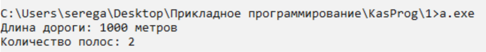

# Пример использования класса Дорога с расширенными возможностями

Этот репозиторий содержит C++ программу, демонстрирующую использование класса `Road` с дополнительными функциями и проверкой пользовательского ввода. Класс `Road` представляет дорогу с определенной длиной, количеством полос и типом (городская улица или автострада). Программа позволяет пользователю вводить данные о дороге, проверяет корректность ввода и выводит информацию о дороге.

## Начало работы

### Необходимые компоненты

Для компиляции и запуска этой программы вам потребуется компилятор C++. Если у вас его нет, вы можете использовать:
- [GCC](https://gcc.gnu.org/)
- [Clang](https://clang.llvm.org/)
- Любой другой компилятор C++ по вашему выбору

### Компиляция программы

1. Клонируйте этот репозиторий:
    ```sh
    git clone https://github.com/yourusername/advanced-road-class-example.git
    cd advanced-road-class-example
    ```

2. Скомпилируйте программу, используя ваш предпочитаемый компилятор C++. Например, с использованием `g++`:
    ```sh
    g++ -o road main.cpp
    ```

3. Запустите скомпилированную программу:
    ```sh
    ./road
    ```




## Обзор кода

### Класс `Road`

Класс `Road` содержит следующие приватные переменные-члены:
- `length` (длина): Длина дороги
- `totalLanes` (общее количество полос): Общее количество полос на дороге
- `lanesPerDirection` (полос в каждом направлении): Количество полос в каждом направлении
- `type` (тип): Тип дороги (городская улица или автострада)

Класс имеет следующие публичные методы:
- Конструктор: `Road(double l, int n, int nPerDirection, RoadType t)`
- Методы-геттеры: `getLength()`, `getTotalLanes()`, `getLanesPerDirection()`, `getType()`
- Метод для получения типа дороги в строковом формате: `getTypeString()`
- Метод для получения информации о дороге в строковом формате: `getInfo(LengthUnit unit)`
- Метод для вывода информации о дороге: `printInfo(LengthUnit unit)`

### Функции для ввода

Программа содержит несколько вспомогательных функций для ввода и проверки данных:
- `clearInputBuffer()`: Очистка буфера ввода
- `safeInputInt()`: Безопасный ввод целых чисел
- `safeInputDouble()`: Безопасный ввод вещественных чисел
- `inputRoadType()`: Ввод типа дороги с проверкой

### Пример использования

В функции `main()` пользователь вводит данные о дороге. Программа проверяет корректность ввода, создает объект `Road` и выводит информацию о дороге.

```cpp
int main() {
    double length;
    int totalLanes;
    int lanesPerDirection;

    RoadType type = inputRoadType();

    std::cout << "Введите длину дороги: ";
    length = safeInputDouble();
    if (length <= 0) {
        std::cerr << "Ошибка: Пожалуйста, введите корректное положительное число для длины дороги.\n";
        return 1;
    }

    std::cout << "Введите общее количество полос: ";
    totalLanes = safeInputInt();
    if (totalLanes <= 0) {
        std::cerr << "Ошибка: Пожалуйста, введите корректное положительное число для общего количества полос.\n";
        return 1;
    }

    std::cout << "Введите количество полос в каждом направлении: ";
    lanesPerDirection = safeInputInt();
    if (lanesPerDirection <= 0 || lanesPerDirection > totalLanes) {
        std::cerr << "Ошибка: Пожалуйста, введите корректное положительное число для количества полос в каждом направлении, не превышающее общее количество полос.\n";
        return 1;
    }

    Road road(length, totalLanes, lanesPerDirection, type);
    road.printInfo(LengthUnit::Meters);

    return 0;
}
```

Этот пример демонстрирует основные возможности класса `Road` и проверку пользовательского ввода в программе.
